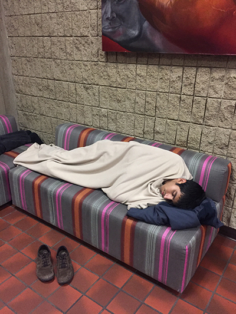
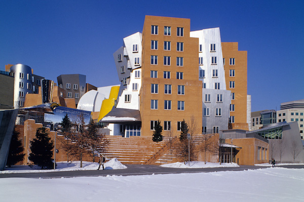
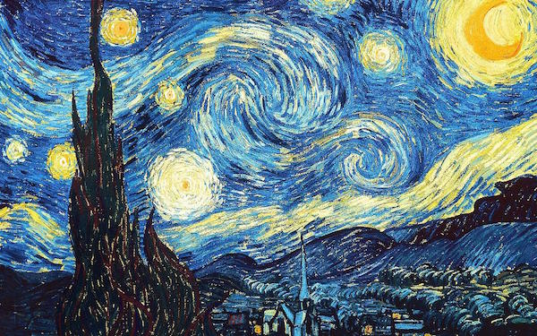

# neural-style

An implementation of [neural style][paper] in TensorFlow.

This implementation is a lot simpler than a lot of the other ones out there,
thanks to TensorFlow's really nice API and [automatic differentiation][ad].

TensorFlow doesn't support [L-BFGS][l-bfgs] (which is what the original authors
used), so we use [Adam][adam]. This may require a little bit more
hyperparameter tuning to get nice results.

## Related Projects

See [here][lengstrom-fast-style-transfer] for an implementation of [fast
(feed-forward) neural style][fast-neural-style] in TensorFlow.

**[Try neural style](https://tenso.rs/demos/fast-neural-style/) client-side in
your web browser without installing any software (using
[TensorFire](https://tenso.rs/)).**

## Running

`python neural_style.py --content <content file> --styles <style file> --output <output file>`

Run `python neural_style.py --help` to see a list of all options.

Use `--checkpoint-output` and `--checkpoint-iterations` to save checkpoint images.

Running it for 500-2000 iterations seems to produce nice results. With certain
images or output sizes, you might need some hyperparameter tuning (especially
`--content-weight`, `--style-weight`, and `--learning-rate`).

The following example was run for 1000 iterations to produce the result (with
default parameters):

These were the input images used (me sleeping at a hackathon and Starry Night):

## Example 2

The following example demonstrates style blending, and was run for 1000
iterations to produce the result (with style blend weight parameters 0.8 and
0.2):

The content input image was a picture of the Stata Center at MIT:

The style input images were Picasso's "Dora Maar" and Starry Night, with the
Picasso image having a style blend weight of 0.8 and Starry Night having a
style blend weight of 0.2:

## Requirements

### Data Files

* [Pre-trained VGG network][net] (MD5 `8ee3263992981a1d26e73b3ca028a123`) - put it in the top level of this repository, or specify its location using the `--network` option.
